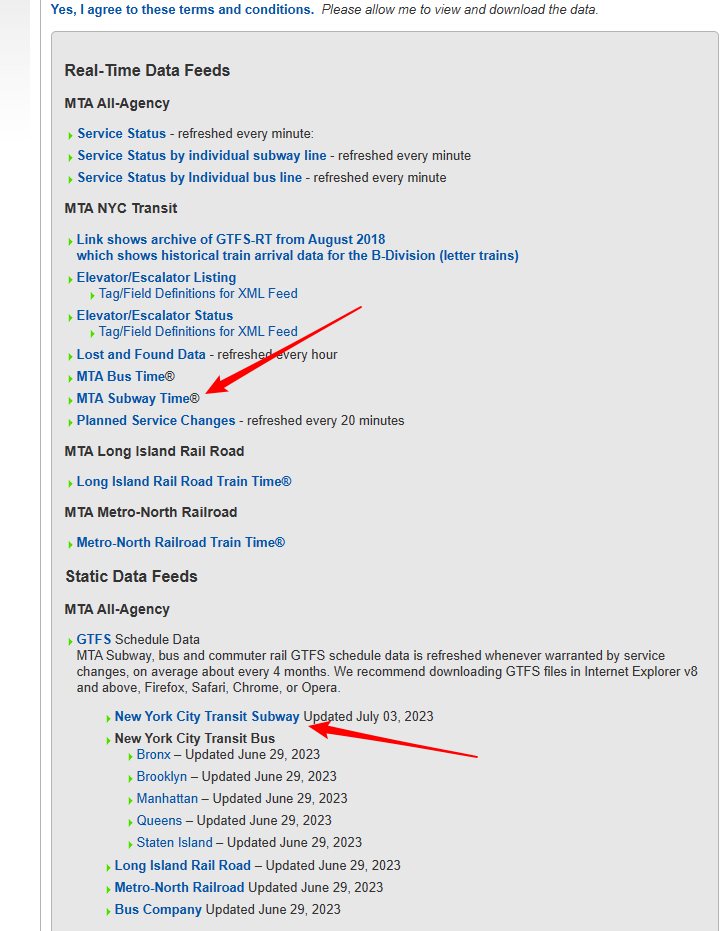

## GeoJson

[GeoJSON](https://geojson.org/)

## GTFS

[MTA Developer Resources](https://api.mta.info/#/landing)

[transit/gtfs-realtime/spec/en/feed-entities.md at master · google/transit · GitHub](https://github.com/google/transit/blob/master/gtfs-realtime/spec/en/feed-entities.md)

[mta.info | Developer Agreement for Access to Data Feeds](http://web.mta.info/developers/developer-data-terms.html#data)

此处可以获取 GTFS 中使用的线路数据：

[LiveTrain.nyc | The MTA and AT&T Present: App Quest 3.0 (devpost.com)](https://2014mtaappquest.devpost.com/submissions/32529-livetrain-nyc)

[livetrain_nyc/public/javascripts/scripts.js at master · mjprude/livetrain_nyc · GitHub](https://github.com/mjprude/livetrain_nyc/blob/master/public/javascripts/scripts.js)

[goodservice.io - New York City Subway Status Page](https://www.goodservice.io/trains)

[The Weekendest - Real-Time New York City Subway Map](https://www.theweekendest.com/trains#40.73403024170918,-74.03990999305302/10.970512671399254/29)

[MTA Live Subway Map](https://map.mta.info/#@40.8082956,-73.9776945,14.02z)

[vasile/GTFS-viz: Converts a GTFS dataset into a SQLite DB + GeoJSONs / KMLs (github.com)](https://github.com/vasile/GTFS-viz)

[vasile/transit-map: The server and client used in transit map simulations like swisstrains.ch (github.com)](https://github.com/vasile/transit-map)

## 地图

### <s>Google Maps Platform</s> 百度地图开放平台

<s>[Google Maps Platform 使用入门  | Google for Developers](https://developers.google.com/maps/get-started?hl=zh-cn)</s>

[jspopularGL | 百度地图API SDK (baidu.com)](https://lbsyun.baidu.com/index.php?title=jspopularGL/guide/getkey)

### MapBox

[Create web maps with GL JS | Mapbox](https://www.mapbox.com/mapbox-gljs)

## 页面

- 主页面（基于百度地图可视化）
- 数据页面（数据表格）

- 关于页面

## 使用项目

[Vuetify — A Vue Component Framework (vuetifyjs.com)](https://vuetifyjs.com/en/)

[yue1123/vue3-baidu-map-gl: 🎉百度地图 GL版 Vue3 组件库，baidu map gl components libary based on Vue3.0 (github.com)](https://github.com/yue1123/vue3-baidu-map-gl)

## 数据

[Normal and New Normal: NYC Subway Traffic 2017-21 | Kaggle](https://www.kaggle.com/datasets/eddeng/nyc-subway-traffic-data-20172021/code)

[notebook787ea033db | Kaggle](https://www.kaggle.com/code/varusjz/notebook787ea033db)

[Metro-New-York.pdf (newyork.cn)](https://image.newyork.cn/wp-content/uploads/2021/06/Metro-New-York.pdf)

## 前端

Vite + Vue

### 组件库

[Vuetify —— 一个 Vue 的 UI 组件框架 (vuetifyjs.com)](https://vuetifyjs.com/zh-Hans/)

[一个 Vue 3 UI 框架 | Element Plus (gitee.io)](https://element-plus.gitee.io/zh-CN/)

[Getting Started - General Transit Feed Specification (gtfs.org)](https://gtfs.org/realtime/)
